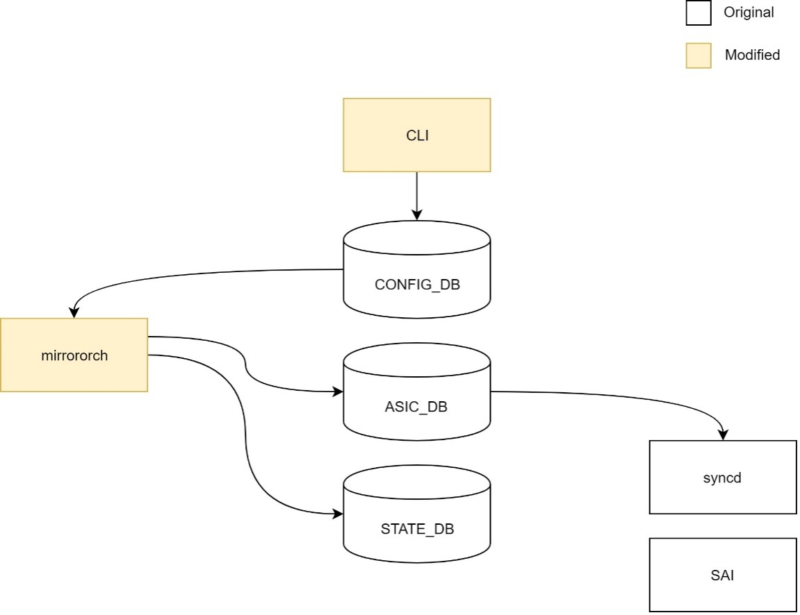
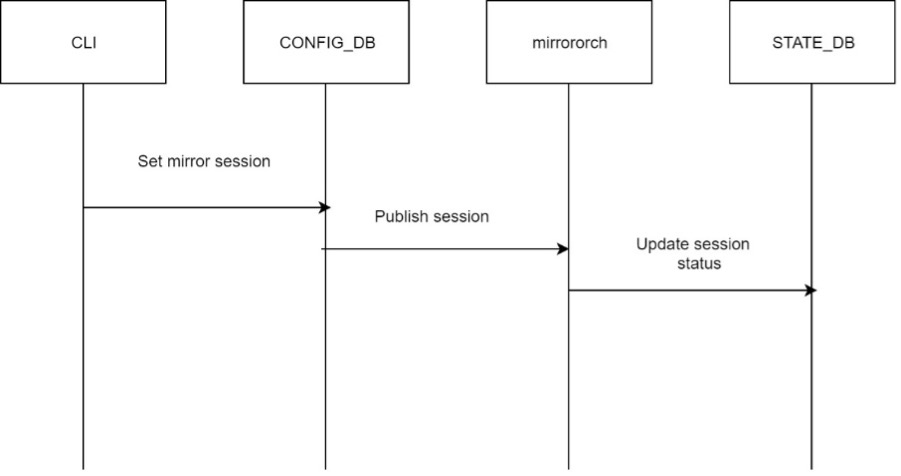

HLD Name

Table of Content

Revision

|Revision| Author| Date |
|----|----|----|
|Initial version|Shaoyu|19/03/2021|

About this Manual
This document provides the high level design for XXX

Definitions/Abbreviations

This section covers the abbreviation if any, used in this high-level design document and its definitions.

| Abbreviation             | Meaning                        |
|--------------------------|--------------------------------|
| SPAN                    | Switch Port Analysis           |

Requirements

This section list out all the requirements for the HLD coverage and exemptions (not supported) if any for this design.
1.	Port/Port-channel mirroring support.
    * TX
    * RX
    * Both
2.	Dynamic session management
    * Allow multiple source to single destination.
    * Mirror session on source portchannel will be always active even though portchannel has no members.
3.	ACL rules can use SPAN session name as the action.
4.	Configuration CLI for mirror session
    * CLI allows SPAN/ERSPAN of mirror sessions.
    * CLI validation for all mandatory parameters in port/portchannel mirroring.

# Architecture Design

This section covers the changes that are required in the SONiC architecture. In general, it is expected that the current architecture is not changed. This section should explain how the new feature/enhancement (module/sub-module) fits in the existing architecture.

 

# Flow
This section covers the process of configuration down to ASIC_DB, the initialization flow of system boot up and Notification flow from SAI to upper layer.

 

 1.	Mirror session is created/removed by CLI and write into CONFIG_DB.
2.	CONFIG_DB publishes the mirror session to mirror orchagent.
3.	Orchagent also update the session status into STATE_DB.

# SAI API

This section covers the changes made or new API added in SAI API for implementing this feature. If there is no change in SAI API for HLD feature, it should be explicitly mentioned in this section. This section should list the SAI APIs/objects used by the design so that silicon vendors can implement the required support in their SAI. Note that the SAI requirements should be discussed with SAI community during the design phase and ensure the required SAI support is implemented along with the feature/enhancement.

# Configuration and management

This section should have sub-sections for all types of configuration and management related design. Example sub-sections for "CLI" and "Config DB" are given below. Sub-sections related to data models (YANG, REST, gNMI, etc.,) should be added as required.

```
config mirror_session <add|remove> span <session_name> <dst_port> [src_port] [direction]
```
```
show mirror_session
session_name      %STRING          ; name of the session, must be unique.
dst_port           %STRING          ; Interface name.
src_port           %STRING          ; Interface name.
direction           %STRING         ; tx|rx|both.
```

# Restrictions/Limitations

Maximum mirror session number is different on different chip vendor.

# Unit Test cases

# System Test cases

# Open/Action items - if any

NOTE: All the sections and sub-sections given above are mandatory in the design document. Users can add additional sections/sub-sections if required.