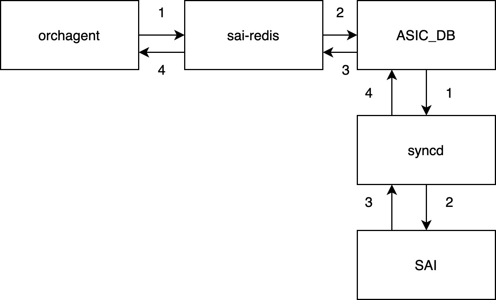

# SONiC Subsystems code flow and source directory in Detail

|Revision| Author| Date |
|----|----|----|
|Initial version|Shaoyu|22/02/2021|
 
Before this introduction, you may refer the [SONiC wiki](https://github.com/Azure/SONiC/wiki/Architecture) to know the basic concept. This article aims to extend the contents of original wiki, provides the source code directory and guides you to trace code flow in these subsystem.  
***
# Table of Contents

  - [Configuration Method and Flow](#configuration-method-and-flow)
    - [SONiC CLI](#sonic-cli)
    - [JSON](#json)
    - [MGMT framework(TBD)](#mgmt-frameworktbd)
    - [FRR MGMT framwork(TBD)](#frr-mgmt-framworktbd)
  - [Database](#database)
    - [Database debug cli and example](#database-debug-cli-and-example)
      - [Example 1. Get specific FDB entry From APPL_DB](#example-1-get-specific-fdb-entry-from-appl_db)
      - [Example 2. Set static FDB entry Into APPL_DB](#example-2-set-static-fdb-entry-into-appl_db)
  - [SWSS flow](#swss-flow)
    - [*syncd](#syncd)
    - [Orchagent](#orchagent)
    - [cfgmgrd](#cfgmgrd)
  - [syncd mechanism](#syncd-mechanism)
    - [Non-blocking operation](#non-blocking-operation)
    - [Blocking operation](#blocking-operation)
  - [Routing-state Interactions](#routing-state-interactions)
  - [Pmon](#pmon)
  
***

## Configuration Method and Flow

SONiC provides several ways to apply configuration to CONFIG_DB. However, some configuration flow will be obsoleted likes swssconfig and minigraph.  Most of developers and customers now use Json or SONIC CLI to Access database. Some of them use mgmt-framework (Cisco like command & REST API).

This section provides JSON, SONiC CLI, REST API, frr-mgmt framework and Cisco like command code flow.

### SONiC CLI
SONiC CLI component heavily relies on Python's Click library and argparse library. 

When user types a command, auto complete engine list the command options which based on current command stage and dispatch to specific module under


    sonic-builimage/src/sonic-utilities


Based on the input parameter, each function integrates key field/value pairs into JSON format. At the end of cli function, get/set API are used to access redis database which were defined in 


    sonic-py-swsssdk/src/swsssdk/configdb.py 

configdb.py provides configDBconnector class and ConfigDBPipeConnector class to handle database access. 
### JSON
Basically, The flow is the same After the configuration turn into JSON format. The most significant difference is JSON file can be a batch of configurations.  

JSON format configuration:
```
{
"ACL_TABLE": {
        "aaa": {
                "type": "L3",
                "ports": "Ethernet0"
        }
   },
"ACL_RULE": {
        "aaa|rule_0": {
        "PRIORITY": "55",
        "PACKET_ACTION": "DROP",
        "L4_SRC_PORT": "0"
        },
        "aaa|rule_1": {
        "PRIORITY": "55",
        "PACKET_ACTION": "DROP",
        "L4_SRC_PORT": "1"
        }
   }
}
```

When using the command

<code><pre>
#load default JSON file /etc/sonic/configdb.json
config load -y

or 

#Specify a configuration file.
config load JSON_FILE -y 
</code></pre>


    sonic-builimage/src/sonic-utilities/config/main.py

will be triggered and invoke sonic-cfggen
which are defined in 

    sonic-buildimage/src/sonic-config-engine/sonic-cfggen

sonic-cfggen is a tool to read SONiC config data from one or more of the following sources:
minigraph file, config DB, json file(s), yaml files(s), command line input,
and write the data into DB, print as json, or render a jinja2 config template.

Finally, using the APIs, which provided by 
configDBconnector and ConfigDBPipeConnector class.
### MGMT framework(TBD)
Management framework is a SONiC application which is responsible for providing various common North Bound Interfaces (NBIs) for the purposes of managing configuration and status on SONiC switches.

Provide support for NBIs such as:

1. CLI
2. gNMI
3. REST/RESTCONF
### FRR MGMT framwork(TBD)

FRR management framwork is now designed in master. Added a new script and corresponding service. Based on the settings in DEVICE_METADATA table, new service will be started along with the bgp container start. And when user changed the BGP or other related table entries in config DB, the daemon will run corresponding VTYSH commands to program on FRR. Also added jinja template to generate FRR config file to be used by FRR daemons while bgp container restarted.
***

## Database 
Hosts the redis-database engine. Databases held within this engine are accessible to SONiC applications through a UNIX socket exposed for this purpose by the redis-daemon. These are the main databases hosted by the redis engine


### Database debug cli and example

In SONiC shell, redis engine provides a cli to look into database entry. You can directly push or get key field/value pairs of the entry and observe the reaction of the procedure.

In schema.h, the database namespace are defined for different usage. 

<pre><code>
#define APPL_DB              0
#define ASIC_DB              1
#define COUNTERS_DB          2
#define LOGLEVEL_DB          3
#define CONFIG_DB            4
#define PFC_WD_DB            5
#define FLEX_COUNTER_DB      5
#define STATE_DB             6
#define SNMP_OVERLAY_DB      7
#define RESTAPI_DB           8
#define GB_ASIC_DB           9
#define GB_COUNTERS_DB      10
#define GB_FLEX_COUNTER_DB  11
#define CHASSIS_APP_DB      12
#define CHASSIS_STATE_DB    13
</code></pre>
Redis engine provides hundreds of thousands of command to deal with database entry. You may reference the link [Redis-cli commands](https://redis.io/commands) to obtain all useful commands. For here, just lists some common debug command.
<pre><code>
#Enter cli of Redis engine and select database namespace, DATABASE_NUM is followed the definition of schema.h

> redis-cli -n DATABSE_NUM 

# Filter entry by KEY_PATTERN
redis>keys *KEY_PATTERN*

# Get all field/value pairs of entry by KEY
redis>hgetall *KEY*

# Set field/value pairs of entry by KEY
redis> hset KEY FIELD VALUE


</code></pre>

### Example 1. Get specific FDB entry From APPL_DB

This example shows how to get specific FDB entry in APP_DB with mac address pattern 00:11:22:33:44:55

<pre><code>
> redis-cli -n 0 or redis-cli(defult APPL_DB)

# Filter entry by KEY_PATTERN 00:11:22:33:44:55
127.0.0.1:6379> keys *00-11-22-33-44-55*
1) "FDB_TABLE:Vlan1:00-11-22-33-44-55"

127.0.0.1:6379> hgetall "FDB_TABLE:Vlan1:00-11-22-33-44-55"
1) "port"
2) "Ethernet1"
3) "type"
4) "Dynamic"


</code></pre>

### Example 2. Set static FDB entry Into APPL_DB

This example shows how to set specific FDB entry in APP_DB with mac address pattern 00:11:22:33:44:51

<pre><code>
#Enter APPL_DB 
> redis-cli -n 0 or redis-cli(defult APPL_DB)

#Set static FDB entry 
127.0.0.1:6379> hset FDB_TABLE:Vlan1:00-11-22-33-44-51 port Ethernet2
(integer) 0
127.0.0.1:6379> hset FDB_TABLE:Vlan1:00-11-22-33-44-51 type static
(integer) 0

#Get entry to check setting result
127.0.0.1:6379> hgetall "FDB_TABLE:Vlan1:00-11-22-33-44-51"
1) "port"
2) "Ethernet2"
3) "type"
4) "static"
</code></pre>

***

## SWSS flow

The Switch State Service (SwSS) container comprises of a collection of tools to allow an effective communication among all SONiC modules. SwSS mainly focuses on offering mechanisms to foster communication and arbitration between all the different parties.

Swss also hosts the processes in charge of the north-bound interaction with the SONiC application layer. Regardless of the context under which these processes operate (inside or outside the swss container).All daemons in SwSS provide the means to allow connectivity between SONiC applications and SONiC's centralized message infrastructure (redis-engine).

Following figure shows the relationship among application, swss container and redis-engine.

 

According this figure, We can briefly divide SwSS into three components

### *syncd

The folder with "Syncd" suffix under

    sonic-buildimage/src/sonic-swss 

mainly listen to application events. 

For example, intfsyncd listens to interface-related netlink events and push collected state into APPL_DB. 

During sync daemon initialization, each module registers communication channel with application.

### Orchagent

During orchagent daemon initialization, each orch module subscribes related database.

    sonic-buildimage/src/sonic-swss/orchagent/orchdaemon.cpp

Orchagent contains logic to extract all the relevant state injected by *syncd daemons and configuration interface, process and message this information accordingly, and finally push it towards ASIC_DB. 

While orchagent invoke south-bound API to push SAI attributes to ASIC-DB, it looks like invoke SAI API directly.


In fact, orchagent invokes "sai-redis" layer API.

The code here is difficult to trace. Please check

    sonic-buildimage/src/sonic-sairedis/lib/src/sai_redis_xxx.cpp
to see how it works. 

***

### cfgmgrd

Daemon of config manager in charge of  reacting state arriving from CONFIG_DB to apply configuration to application. 

These daemons are in following directory.

    sonic-buildimage/src/sonic-swss/cfgmgr/

## syncd mechanism

syncd's container goal is to provide a mechanism to allow the synchronization of the switch's network state with the switch's actual hardware/ASIC. This includes the initialization, the configuration and the collection of the switch's ASIC current status.

By default, g_syncMode is set to false to disable the synchronization mode between orch and syncd. Therefore, There are several operations for orchagent to access ASIC state that can be divide into two operation type. 

For non-blocking method, orch doesn't get real return code from sai. The return code here is alway SAI_STATUS_SUCCESS.

### Non-blocking operation
* create
* remove
* set
* notify
* flush



### Blocking operation
* get

For blocking method, orchagent invoke "select" to wait response from SAI.


***

## Routing-state Interactions
In this section we will iterate through the sequence of steps that take place in SONiC to process a new route received from an eBGP peer. We will assume that this session is already established and that we are learning a new route that makes use of a directly connected peer as its next-hop.

The following figure displays the elements involved in this process. Notice that I'm deliberately obviating details that are not relevant to this SONiC's architectural description.


0. During BGP container initialization,
sonic-buildimage/src/sonic-frr/frr/bgpd/bgp_main.c will be invoked to start.
zebra connects to fpmsyncd through a regular TCP socket. Routesync will be registered as message handler for RTM_NEWROUTE/RTM_DELROUTE before a connection is established in sonic-buildimage/src/sonic-swss/fpmsyncd/fpmlink.cpp.

1. A new TCP packet arrives at switch pipeline, bgp's socket will be trapped to CPU port and to Linux kernel by COPP rule. Kernel's network-stack eventually delivers the associated payload to bgpd process.

2. Bgpd parses the new packet, process the bgp-update and notifies zebra of the existence of this new prefix and its associated protocol next-hop.

3. Upon determination by zebra of the feasibility/reachability of this prefix (e.g. existing forwarding nh), zebra_fpm.cpp encodes a route-netlink message to inject this new state in kernel.

4. routesync receives this netlink-route message from zebra.

5. onMsg in routesyncd is invoked to parse the payload of netlink messages and push this routing state into APPL_DB.

6. Being orchagentd an APPL_DB subscriber, routeorch(sonic-buildimage/src/sonic-swss/orchagent/routeorch.cpp) consumes the content of the information previously pushed to APPL_DB.

7. After processing the received information, routeorch will invoke sairedis APIs to inject the route information into ASIC_DB.

8. Being syncd an ASIC_DB subscriber, it will receive the new state generated by routeorch.

9.  Syncd will process the information and invoke SAI APIs to inject this state into the corresponding asic-driver.

10. New route is finally pushed to hardware.


## Pmon
Pmon container runs several daemons which used to periodically monitor state from hardware components and to alert when an alarm is signaled.

Following are the tables used/updated by various daemons in PMON docker,

* PSU daemon: CHASSIS_INFO , PSU_INFO tables in state_db
* Syseepromd daemon: EEPROM_INFO in state_db
* Thermalctld daemon: FAN_INFO, TEMPERATURE_INFO in state_db
* Ledd daemon: PORT_TABLE in app_db
* Xcvrd daemon: TRANSCEIVER_INFO, TRANSCEIVER_DOM_SENSOR, TRANSCEIVER_STATUS in state_db. PORT_TABLE in app_db

All the daemons are defined in 

    sonic-buildimage/src/sonic-platform-daemons

Platform API that used in daemon is installed as a Python package, "sonic_platform_base" which consists of abstract base classes for each type of platform peripheral device.

"sonic_platform_base" class is defined in 

    sonic-buildimage/src/sonic-platform-common/sonic_platform_base/

Platform provider needs to provide the implementation of platform class plugin.  

***
